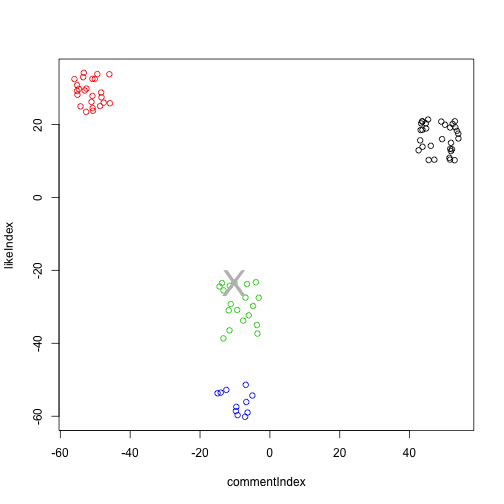

## Concept
1. Analyze user engagements with his friends.
2. Assumption: closer friends will engage most with the user.
3. Quantify every friend it terms of 'like_count' and 'comment_count' on user's status messages.
4. Map each user to 2-dimensional space.
5. Visualize the proximity of these points (facebook users).

---

## Features
1. Provide access token to his facebook account for clustering of his friends.
2. Visualize his friends in lying in different clusters.
3. Select the number of clusters he want's his friends to be grouped into.
4. View the list of friends that belong to a particular cluster.
5. Configure the number of friends to viewed in the cluster.
6. View the cluster to which you belong to.

---

## Algorithm

1. User's status data is collected using facebook graph API.
3. Likes, comments and the friend who has liked or commented is fetched.
4. Raw data is then aggregated so as to find the total like count and comment count by every friend of the user as well the user himself.
5. The aggregated data is then modelled using a random forest.
6. Random Forest's proximity matrix is used to detect the closeness of users.
7. The proximity matrix is fed to k-means algorithm to return the required clusters.

---

## Example cluster of a Facebook user


```r
    plot(rfd, col=km$cluster, xlab = 'commentIndex', ylab = 'likeIndex')
    text(rfd[userIndex,1], rfd[userIndex,2], label='X', cex=3, col = 624)
```

 

